### FEBS-System

FEBS-System是一款简单高效的后台权限管理系统，使用Spring Boot，Shiro和Layui构建。

FEBS意指：**F**ast，**E**asy use，**B**eautiful和**S**afe。

### 本地部署

本地部署账号密码：

账号 | 密码| 权限
---|---|---
K | KAG1823 |超级管理员，拥有所有增删改查权限
scott | 1234qwer | 注册账户，拥有查看，新增权限（新增用户除外）和导出Excel权限
micaela | 1234qwer |系统监测员，负责整个系统监控模块
Jana   | 1234qwer  |跑批人员，负责任务调度跑批模块
Khighness | KAG1823 |注册账号

### 系统模块
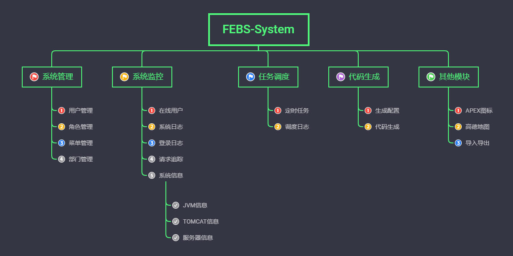

### 系统特点

1. 前后端请求参数校验
2. 支持Excel导入导出
3. 前端页面布局多样化，主题多样化
4. 支持多数据源，代码生成
5. 多Tab页面，适合企业应用
6. 用户权限动态刷新
7. 浏览器兼容性好，页面支持PC，Pad和移动端。
8. 代码简单，结构清晰

### 技术选型

> 后端

- Maven 
- Spring Boot 
- Mybatis-Plus
- MySQL 
- Shiro 

> 前端
- Layui 
- Nepadmin
- formSelects 4.x 多选框
- eleTree 树组件
- formSelect.js树形下拉
- Apexcharts图表

### 系统截图

<h5>登录&注册</h5>

<table>
  <tr>
     <td width="50%" align="top">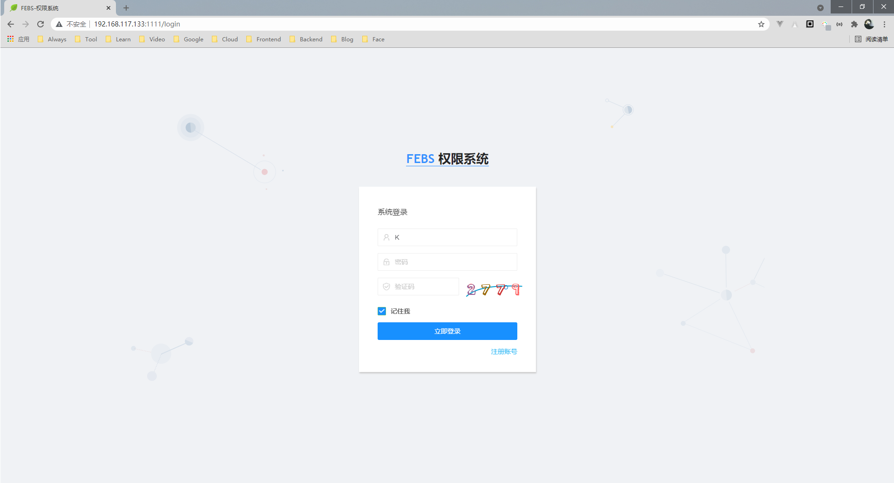</td>
     <td width="50%" align="top">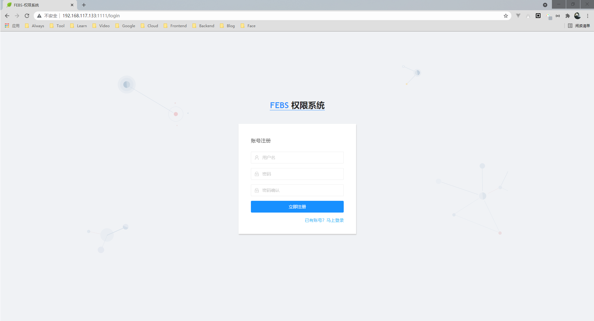</td>
  </tr>
</table>

<h5>首页&个人</h5>

<table>
  <tr>
     <td width="50%" align="top">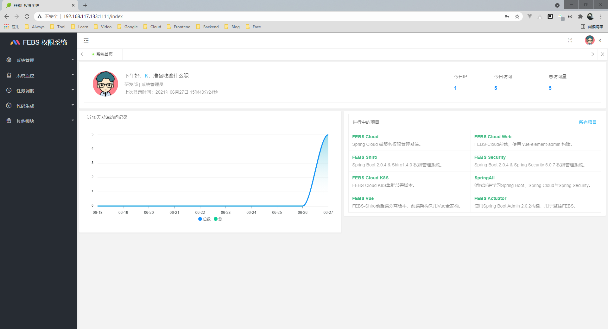</td>
     <td width="50%" align="top">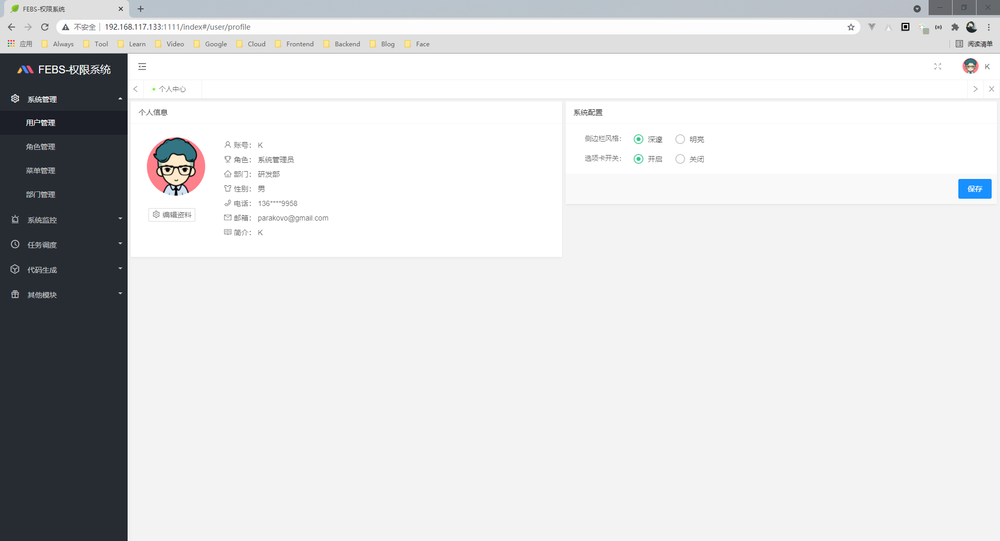</td>
  </tr>
</table>

<h5>系统管理</h5>

<table>
  <tr>
     <td width="50%" align="top">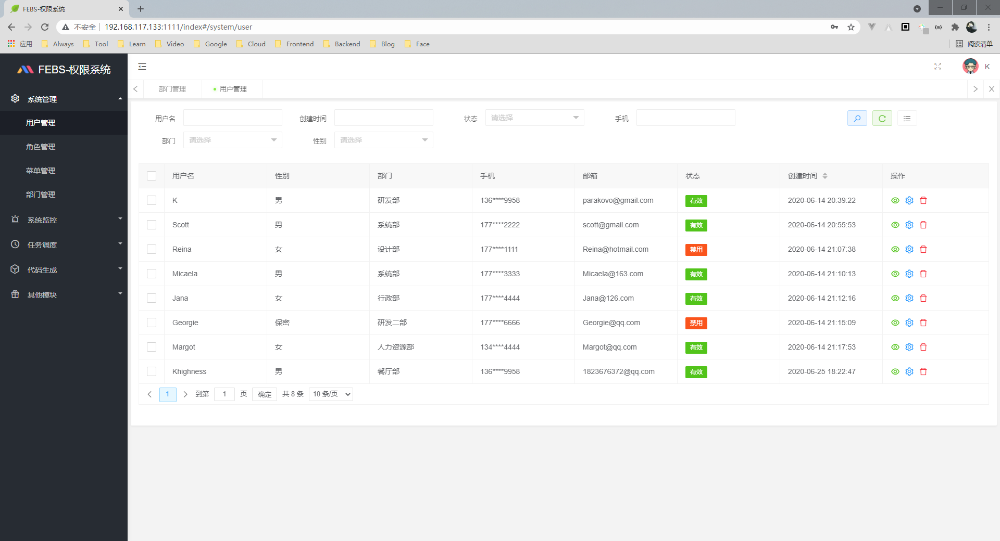</td>
     <td width="50%" align="top">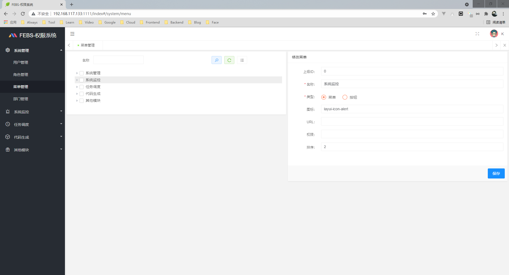</td>
  </tr>
</table>

<h5>系统监控</h5>

<table>
  <tr>
     <td width="50%" align="top">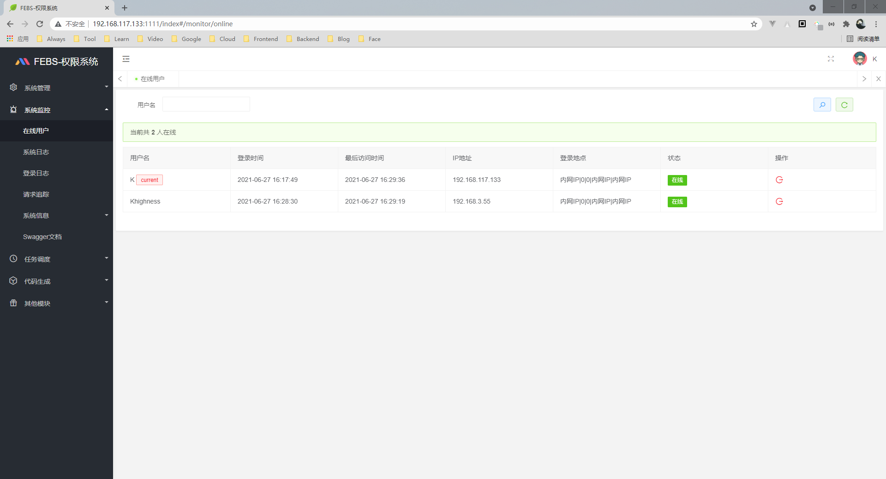</td>
     <td width="50%" align="top">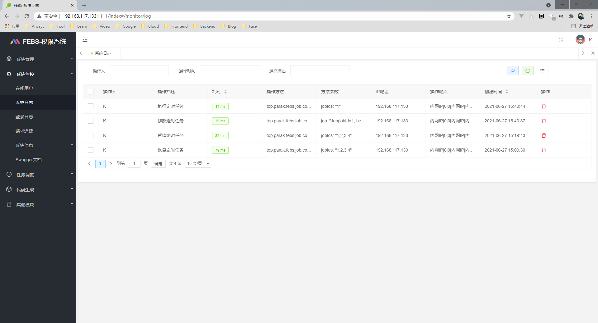</td>
  </tr>
  <tr>
     <td width="50%" align="top">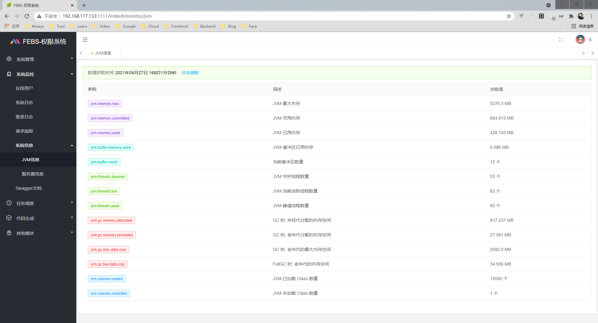</td>
     <td width="50%" align="top">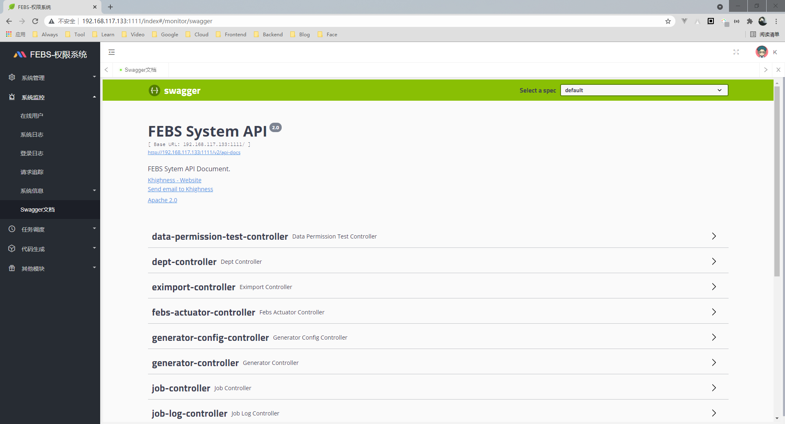</td>
  </tr>
</table>

<h5>任务调度</h5>

<table>
  <tr>
     <td width="50%" align="top">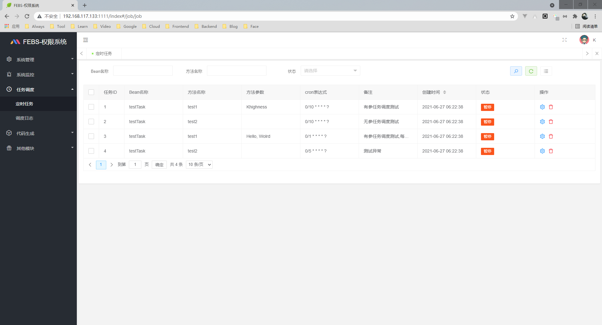</td>
     <td width="50%" align="top">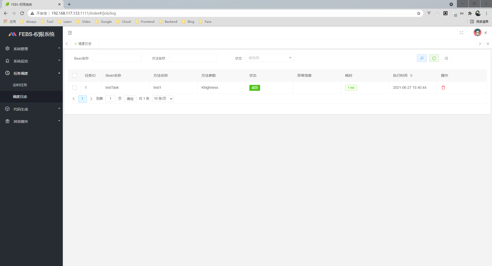</td>
  </tr>
</table>

<h5>代码生成</h5>

<table>
  <tr>
     <td width="50%" align="top">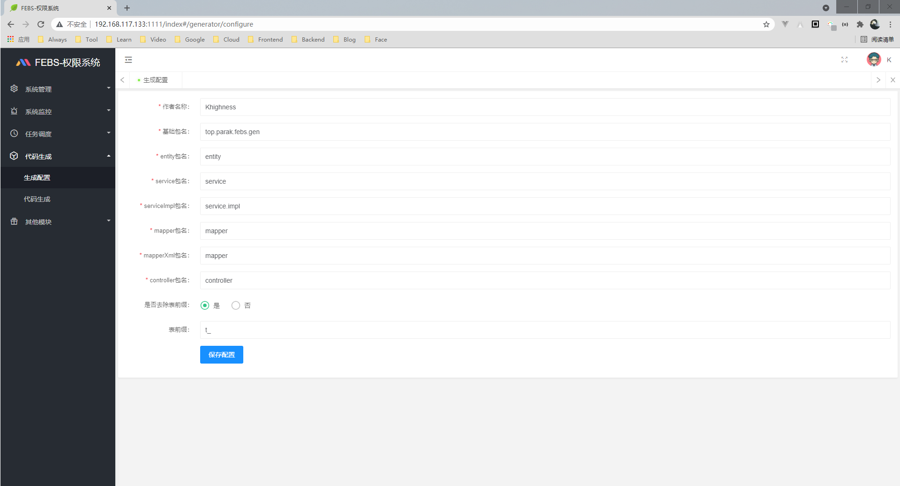</td>
     <td width="50%" align="top">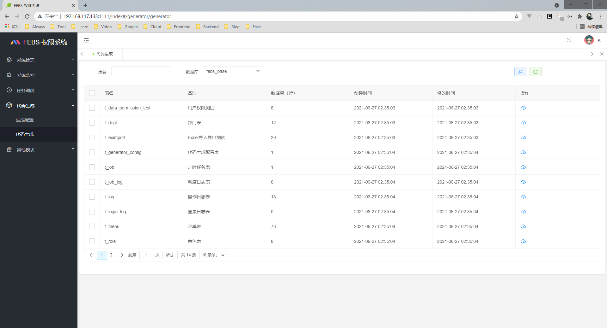</td>
  </tr>
</table>

<h5>其他模块</h5>

<table>
  <tr>
     <td width="50%" align="top">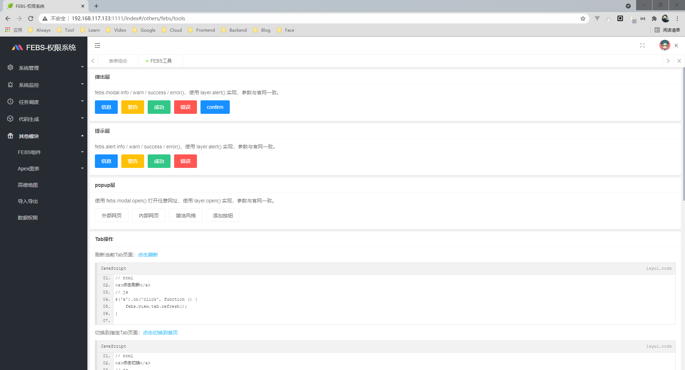</td>
     <td width="50%" align="top">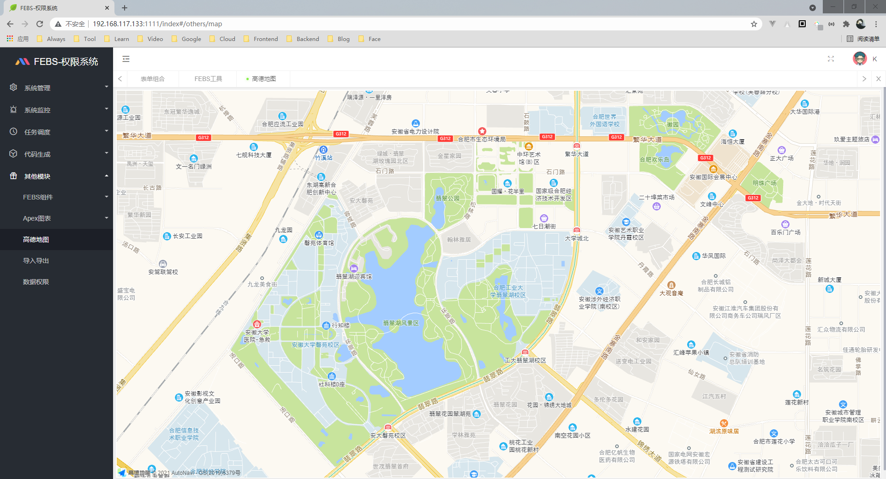</td>
  </tr>
</table>

### 浏览器兼容

|  |  |  |  |  |  |
| ------------------------------------------------------------ | ------------------------------------------------------------ | ------------------------------------------------------------ | ------------------------------------------------------------ | ------------------------------------------------------------ | ------------------------------------------------------------ |
| Internet Explorer 10+                                        | Edge                                                         | Firefox last 15 versions                                     | Chrome last 15 versions                                      | Safari last 10 versions                                      | Opera last 15 versions                                       |

### 反馈交流

欢迎加入一起~~交流技术~~划水水：

### 特别感谢

